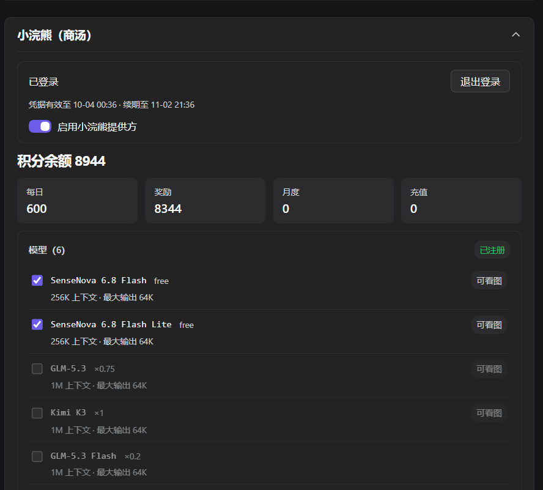

# dsh-connect-sensenova-token-plan

把商汤接进 DSH 的 **Plugins 页**插件卡，三个 tab 按使用顺序排列：

- **积分额度**——登录一次，实时查看积分余额、额度窗口与每模型消耗，令牌自动续期，之后无需再管；
- **接入 API**——把商汤模型注册为 DSH provider，参与对话与出图；
- **小浣熊**——微信扫码接入 `xiaohuanxiong.com`，上游限流较宽松的另一条商汤产品线，独立账号、独立积分。

后台另有 429 自愈：限频被误判为"额度耗尽"时在 Host 侧纠正回退避重试，模型不会无端"消失"。

> **AI 协作会话请先读 [AGENTS.md](AGENTS.md)**——验证入口、红线与文档地图都在那里；过程文档与提交历史本身就是本仓库工作面的一部分。
> 三个常被外部审读问起的疑问，预答在这里：
> - `lib/` 与根 `client.js` 是**入库的构建产物**：`github:` 安装源不跑 prepack，不入库则直装即坏（[docs/ADR.md](docs/ADR.md) ADR-005）
> - `docs/sensenova-api-reference/` 是商汤**官方文档的本地容器**，逐文件出处与许可见 [THIRD_PARTY_NOTICES.md](THIRD_PARTY_NOTICES.md)
> - 本仓库由 AI 协作开发，其提交历史里的过程痕迹是工作方式的一部分，不是疏漏

## ① 积分额度

把商汤 Token Plan 搬进 DSH，写代码时不用切网页就能盯住：

- **积分池**：额度窗口（已用 / 剩余 / 百分比 / 重置时间）、返赠余额与到期时间
- **模型清单**：套餐覆盖 vs 当前 Key 实际能调，一眼看出哪些模型需要开通
- **每模型消耗**：近 N 小时各模型积分排名，"烧分大户"一目了然


首次使用在「连接商汤控制台」填一次账号和密码，之后令牌自动续期。
- 登录失败时表单会直接显示商汤返回的原因（含「3 次错误锁 15 分钟」这类平台硬规则）；
- 想清除账号，用面板底部的按钮。

## ② 接入 API（可选，默认关）

把商汤模型注册为 DSH provider，参与对话与出图。
- 在「API Key」卡粘贴 `sk-` Key 保存后，Host 即以 `sensenova-token-plan` 之名注册 OpenAI 兼容 provider
- **语言模型**：模型列表随 `/v1/models` 自动刷新、可看图模型自动带图片输入；
- **出图工具**：Host 给 agent 注册工具 `sensenova_draw_image`；模型由 catalog 的 `output_modalities` 结构化判定。
- 开关与勾选都在面板热生效，无需重启**，**但工具的实际挂载 / 缺席发生在**下一次 Host 启动**。细节见 [docs/SETUP.md](docs/SETUP.md) §4 与 [docs/PROVIDER-HOT-RELOAD.md](docs/PROVIDER-HOT-RELOAD.md)。


## ③ 小浣熊（可选，默认关）

微信扫码登录 `xiaohuanxiong.com` 网关，独立账号、独立积分余额。

- 上游限流较宽松，适合当作 Token Plan 硬配额池之外的日常通道
- 登录后显示积分余额与模型清单
- 每个模型带**上下文窗口 / 最大输出**与积分倍率（`free` / `×0.75` 这类，由网关目录声明；目录没给就不显示，不猜）
- **联网搜索**（默认关）：开启后 DSH 的 `web_search` 工具后端换成小浣熊托管的 MCP，复用小浣熊凭据，无需再单独配搜索端点 key



## 边界

- 面板**不代你操作账务**：不改套餐、不代扣积分、不碰 Key 明文
- 数据来自商汤控制台自己的 API，与网页控制台口径一致
- 真正会「动」的四部分——注册 provider、挂出图工具、接第二个上游、切换联网搜索——全部 opt-in 且**默认关闭**，不打开时插件退化为纯信息展示

## 安装

1. 在 DSH「插件」页搜索 `dsh-connect-sensenova-token-plan` 点击安装，或运行：

   ```powershell
   dsh plugin --profile web add dsh-connect-sensenova-token-plan       # Web 端
   dsh plugin --profile desktop add dsh-connect-sensenova-token-plan  # 桌面端
   ```

2. **完全退出 DSH（含托盘）再启动**。

3. 打开 DSH 的 **Plugins 页**，找到本插件的插件卡（面板是页内的内联卡片，**不在侧边栏**）。

## 它是怎么工作的

登录原理：

- Host 在后台用商汤标准登录拿令牌，并**自动续期**（refresh_token 到期前自动换新，所以不用你再输密码）
- 面板打开时才轮询一个只读本地路由，关掉即停
- 协议细节（OIDC/PKCE、密码 JWE 封包、防锁号节流）见 [docs/AUTH.md](docs/AUTH.md)，接口契约见 [docs/SENSENOVA-API.md](docs/SENSENOVA-API.md)

## 文档

- [docs/ARCHITECTURE.md](docs/ARCHITECTURE.md) — 架构与数据流
- [docs/SETUP.md](docs/SETUP.md) — 配置字段、改动后重启、常见信号
- [docs/AUTH.md](docs/AUTH.md) — 登录 / 续期 / 节流设计
- [docs/API.md](docs/API.md) — 路由与控制台端点
- [docs/TESTING.md](docs/TESTING.md) — 测试体系
- [docs/SENSENOVA-API.md](docs/SENSENOVA-API.md) — 商汤接口全集（实测）
- [docs/PITFALLS.md](docs/PITFALLS.md) — 真实踩坑（40 条）
- [CHANGELOG.md](CHANGELOG.md) — 版本变化
- [docs/README.md](docs/README.md) — docs/ 全量索引（含 ADR / ROADMAP / PROVIDER-HOT-RELOAD / TROUBLESHOOTING 等上表未列的）

> 装到 npm 的那一份 **不含 `docs/`**（`package.json` 的 `files` 白名单只带 `cordis.patch.yml` / README / CHANGELOG / THIRD_PARTY_NOTICES 等），上列 `docs/*` 链接在已安装副本上不可用，请到 GitHub 仓库看。

## 运维诊断：这台机器现在挂没挂 provider？

- 遇到问题先看 [docs/TROUBLESHOOTING.md](docs/TROUBLESHOOTING.md)——它按**你看到的现象**组织（额度栏空的、反复要求登录、模型不出现、改了代码没生效…），而不是按主题；每条带稳定症状码，`doctor --json` 的 `symptoms` 字段直接给症状码，人和 agent 走同一条路。
- provider / 出图开关的生效值存在插件私有状态文件里，不在任何配置或路由上。按 profile 分段（见 `docs/PITFALLS.md` §23）：`$DSH_HOME/state/<profile>/<name>/`，取不到 profile 名时退回共享目录 `$DSH_HOME/state/<name>/`——查"到底开没开"用 doctor，它只读状态文件、不碰凭据，Host 没起也能跑：

```powershell
npm run doctor          # 人读：每个 profile 的 provider / draw 开关与模型清单
npm run doctor:json     # 机器读：JSON（可进你的巡检 / 工单脚本）
```

## 诚实声明

- 面板显示的是**控制台自己的口径**，与网页控制台一致；`GET /v1/models` 只区分权限，不计费也不占推理额度；
- 续期在令牌过期前触发；若 refresh_token 被吊销且环境里已无密码，面板会明确提示重新登录，而不是静默显示旧数据；
- 凭据（账号、access/refresh token）只经 DSH 凭据服务保存，**密码不落盘**；本插件不写任何明文凭据文件或调试日志。

## 许可证

MIT License（Copyright (c) 2026 eghrhegpe），全文见 [LICENSE](LICENSE)；第三方依赖与合规说明见 [THIRD_PARTY_NOTICES.md](THIRD_PARTY_NOTICES.md)。
